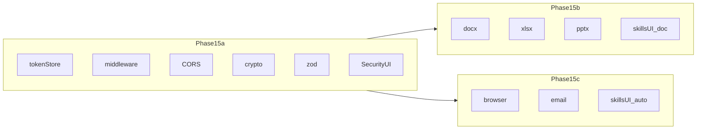

# 阶段 15：安全加固 + 生产力技能补强

> **目标**：把 SwellLobster 从"个人开发机本地可用"推进到"可以放心打开远程访问、IM 触发、生成可交付文档"。
> **预估工作量**：3 周 —— 建议按子阶段 **[15a](#p15-subphases)** / **[15b](#p15-subphases)** / **[15c](#p15-subphases)** 分拆合并（约各 1 周；15b 与 15c 可在 15a 合主干后并行开发）。
> **前置条件**：阶段 1-14 已完成，桌面端实机验证通过

---

## 背景与问题

阶段 1-14 把核心能力补齐后，当前系统的真实瓶颈是两类：

1. **安全裸奔**：后端 `127.0.0.1:18900` 完全开放、CORS `*`、IM Token / LLM API Key 在 SQLite 明文存储。一旦用户开远程访问、共享网络、或换台机器导出数据库，全部凭据外泄。这是开放 IM 渠道、移动端访问的前置阻塞。
2. **技能太轻**：现有 5 个技能（summary / search / review / translate / decompose）都是"加工文字"，产出仍是 Markdown 文本。对照 LobsterAI / openakita 的用户场景，缺真正"做事交付"的能力——用户要的是一份 PPT、一张表格、一份 Word 报告。

阶段 15 把这两件事一起做，避免技能扩展后再回头补安全。

---

## 目标范围

本阶段完成：

1. API 鉴权（本机 token + 可选远程 token）
2. 敏感字段加密（IM Token、LLM API Key、Webhook Secret）
3. 输入校验与 CORS 收紧
4. 文档生成技能：`docx_writer` / `xlsx_writer` / `pptx_writer`
5. 浏览器自动化技能：`browser_automation`（基于已装 playwright 插件）
6. 邮件技能：`email_send` MVP（仅 SMTP 发件；收件 / IMAP 留后续）

**本阶段不做：**

- 不做 OAuth / 多用户体系（仍然单用户）
- 不做完整 RBAC（只做 token 级 allow/deny）
- 不做 OS 级沙箱（留给阶段 16）
- 不做技能市场 / 在线安装

---

## Phase15 子阶段拆分

<a id="p15-subphases"></a>

为降低单次合并与验收粒度，在同一阶段文档内按下表交付；**阶段 15 完结 = 三个子阶段全部完结**。

| 子阶段             | 范围（对应下文步骤）                                                                                                                                                                                      | 建议时长 | 说明                                                                                                                                  |
| ------------------ | --------------------------------------------------------------------------------------------------------------------------------------------------------------------------------------------------------- | -------- | ------------------------------------------------------------------------------------------------------------------------------------- |
| **15a** 安全底座   | [步骤 1–6](#p15a-security) + [数据迁移](#数据迁移) 中与 `auth_tokens`、密钥加密、`migrateExistingSecrets` 相关内容 + [验收·15a](#accept-15a)                                                              | ~1 周    | 应先闭环——远程暴露、IM 扩展都依赖鉴权/CORS/密文存储；观测事件 `auth.token.used` / `auth.token.revoked` / `secret.migrated` 在此收口。 |
| **15b** 办公导出   | [步骤 7–9](#p15b-docs) 及 [步骤 12](#p15-step12) 中与 **docx / xlsx / pptx** 技能模板、Skills 页「文档生成」分组 + [验收·15b](#accept-15b)                                                                | ~1 周    | 无外联网络高危面；在 **15a 合并进主干之后** ，可与 **15c 并行** 分支开发。                                                            |
| **15c** 外向自动化 | [步骤 10–11](#p15c-automation)、[步骤 12](#p15-step12) 中与 **browser / email** 技能模板及分组；[步骤 11](#p15-step11) 依赖 `kv` 中 SMTP 密码加密（依托 15a 的 `secretFields`） + [验收·15c](#accept-15c) | ~1 周    | 强依赖 [阶段 11](./phase11-execution-approval.md) 审批门；`browser_automation` / `email_send` 均为 `risk: 'high'`。                   |

**推荐合并与任务粒度**：先 **15a-merge**（安全与迁移），再并行 **15b-merge**、**15c-merge**；任务实例可落在 [docs/tasks/](../tasks/README.md)（例如 `2026-xx-xx-phase15a-security.md`），不必与本文同文件。



---

## 与参考项目对照（含 OpenClaw）

<a id="p15-refs-openclaw"></a>

本阶段仍以对齐 **LobsterAI / openakita** 为主；**OpenClaw**（同类「个人助手 + Gateway」）适合作能力与安全维度的对照，**不宜整仓照搬**。

| 维度         | OpenClaw（外部参考）                                                                                                      | SwellLobster 本阶段取舍                                                                                                                                                                                                   |
| ------------ | ------------------------------------------------------------------------------------------------------------------------- | ------------------------------------------------------------------------------------------------------------------------------------------------------------------------------------------------------------------------- |
| 产品形态     | Gateway 控制面、多通道、Onboard CLI                                                                                       | 目标一致：开放远程 / IM 前必须先补 API 与秘密面                                                                                                                                                                           |
| Gateway 鉴权 | 多模式：`token` / `password` / `tailscale` / `device-token` / `bootstrap-token` / `trusted-proxy`，配合限流与 origin 策略 | 先做 **本机文件 token + 可撤销远程 token + CORS 白名单**；**Tailscale / 设备信任** 未纳入 15，可作为 [后续阶段](#p15-phases-followup) 扩展，避免与「单用户、无 OAuth」前提冲突                                            |
| 密钥落盘     | 凭据目录取 `~/.openclaw/credentials/`，与业务状态分离                                                                     | 15 采用 **`data/auth/master.key` + SQLite 字段密文**；长期倾向 **凭据与业务 DB 分层** 见 [阶段 15.x / 16](#p15-phases-followup)                                                                                           |
| 安全工程化   | 仓库内 OpenGrep 规则包进 CI                                                                                               | 可选：在现有 `verify` 旁增加 **敏感 API 静态规则**（类 OpenGrep），不阻塞 15a 交付                                                                                                                                        |
| 技能「交付」 | 大量 `SKILL.md` + `requires.bins`（如 Himalaya 邮件 CLI、nano-pdf、Peekaboo）                                             | 15 选 **内置 TypeScript 工具**（`docx` / `exceljs` / `pptxgenjs` / `nodemailer` / Playwright）：**单仓可测、不依赖用户本机 CLI 版本**；与 OpenClaw 的「外挂二进制」路线并存为设计差异，不在本阶段引入 Himalaya / nano-pdf |
| 邮件         | Himalaya：IMAP + SMTP 全链路                                                                                              | **15c 仅 SMTP 发件 MVP**；IMAP 收件与外部 CLI 方案留到后续                                                                                                                                                                |

---

## 模块结构

```text
src/tide-lobster/src/
  auth/
    tokenStore.ts            本机 token 与远程 token 管理
    middleware.ts            Hono 鉴权中间件
    crypto.ts                字段级加解密（AES-256-GCM）
  api/
    server.ts                注入 auth 中间件，收紧 CORS
    routes/auth.ts           token 列出 / 创建 / 撤销 API
  store/
    secretFields.ts          受保护字段清单与读写包装
  tools/builtins/
    docx_writer.ts
    xlsx_writer.ts
    pptx_writer.ts
    browser_automation.ts
    email_send.ts
  skills/templates/          对应的 markdown 技能模板与 frontmatter

apps/web-ui/src/
  pages/Settings/Security/   token 管理 + 主密钥首次设置
  pages/Skills/              新增"文档技能"分组
  api/client.ts              请求统一注入 X-Auth-Token
```

---

<a id="p15a-security"></a>

## 模块一：安全加固（子阶段 15a）

### 步骤 1：本机访问令牌

**新建** `src/tide-lobster/src/auth/tokenStore.ts`

要求：

- 启动时读取 `data/auth/local-token` 文件，不存在则生成 32 字节随机 token，权限 `0600`
- 桌面端首次启动自动写入；远程模式（`SWELL_REMOTE=1`）启动时如缺失则在控制台一次性打印
- 支持额外远程 token：`auth_tokens` 表，字段 `id / token_hash / label / scope / created_at / last_used_at / revoked_at`
- token 不明文存盘，存 `sha256(token)`

DB migration（新版本号，沿用 db/index.ts 现有迁移机制）：

```sql
CREATE TABLE auth_tokens (
  id INTEGER PRIMARY KEY AUTOINCREMENT,
  token_hash TEXT NOT NULL UNIQUE,
  label TEXT NOT NULL,
  scope TEXT NOT NULL DEFAULT 'full',
  created_at INTEGER NOT NULL,
  last_used_at INTEGER,
  revoked_at INTEGER
);
```

### 步骤 2：Hono 鉴权中间件

**新建** `src/tide-lobster/src/auth/middleware.ts`

规则：

- `GET /api/health`、`POST /api/shutdown` 不鉴权
- 其他 `/api/*` 必须带 `X-Auth-Token` header 或 `?token=` query
- 桌面端 sidecar 通过环境变量 `SWELL_LOCAL_TOKEN` 自动注入到请求 header
- 失败时返回 `{ detail, code: 'AUTH_REQUIRED' }`，HTTP 401
- 命中后写 `last_used_at`，频率不超过 1 次/秒（避免高频写库）

落到 `api/server.ts`：

```ts
app.use('/api/*', requireAuthToken({ exempt: ['/api/health', '/api/shutdown'] }));
```

### 步骤 3：CORS 收紧

`api/server.ts` 现状：`origin: '*'`、`allowHeaders: [Content-Type, Authorization]`

调整为：

- 默认 origin 白名单：`http://localhost:5173`、`tauri://localhost`、`http://127.0.0.1:18900`
- `SWELL_CORS_ORIGINS` 环境变量可追加（逗号分隔）
- `allowHeaders` 增加 `X-Auth-Token`
- `credentials: true`（远程 token 模式下浏览器需要带 cookie）

### 步骤 4：字段级加密

**新建** `src/tide-lobster/src/auth/crypto.ts`

- 算法：AES-256-GCM
- 主密钥：从 `data/auth/master.key` 读取（首启生成，权限 `0600`）；远程模式可用 `SWELL_MASTER_KEY` 覆盖
- 密文格式：`enc:v1:<iv>:<ciphertext>:<authTag>`，全部 base64
- 未加密旧值直读直写（兼容期判定：不以 `enc:` 开头视作明文）

**新建** `src/tide-lobster/src/store/secretFields.ts`

集中维护受保护字段清单：

| 表                | 字段                                                         |
| ----------------- | ------------------------------------------------------------ |
| `llm_endpoints`   | `api_key`                                                    |
| `im_channels`     | `config.token`、`config.app_secret`、`config.webhook_secret` |
| `mcp_servers`     | `env.*_KEY`、`env.*_TOKEN`（按 key 模式匹配）                |
| `scheduler_tasks` | `webhook_payload` 中的密钥字段                               |

提供 `wrapStore(rawStore, fields)` 高阶函数，CRUD 自动加解密。

启动时跑一次 `migrateExistingSecrets()`：扫描表，把明文值加密落回。日志按"已加密 N 条"汇总，不打印原值。

### 步骤 5：输入校验

边界统一用 `zod` schema：

- `api/routes/*.ts` 内 POST/PATCH 请求体 schema 化
- 校验失败返回 `{ detail, code: 'VALIDATION_FAILED', issues: [...] }`
- IM Token 字段强制最小长度（避免空字符串绕过）
- Webhook URL 强制 `https://`（开发模式可放开）

不动 GET 查询参数（量大，按需补）。

### 步骤 6：前端集成

`apps/web-ui/src/api/client.ts`：

- 启动时从 `tauri://invoke('get_local_token')` 或 `localStorage.swell_token` 取 token，统一注入 `X-Auth-Token`
- 401 时跳转 `Settings/Security` 提示重新输入

新增 `apps/web-ui/src/pages/Settings/Security/`：

- 主密钥状态（未设置 / 已设置）
- 远程 token 列表 + 创建 / 撤销
- 重置本机 token（清空文件 + 重启）

---

## 模块二：生产力技能（子阶段 15b + 15c）

<a id="p15b-docs"></a>

### 15b · 文档导出（docx / xlsx / pptx）

### 步骤 7：docx_writer

**新增依赖**：`docx`（npm 包，纯 JS、无原生依赖）

**新建** `src/tide-lobster/src/tools/builtins/docx_writer.ts`

参数 schema：

```ts
{
  filename: string;            // 不带扩展名
  title?: string;
  sections: Array<{
    heading?: { level: 1|2|3; text: string };
    paragraphs?: Array<string | { text: string; bold?: boolean; italic?: boolean }>;
    bullets?: string[];
    table?: { headers: string[]; rows: string[][] };
  }>;
}
```

输出：`data/exports/docx/<filename>-<timestamp>.docx`，返回相对路径与字节数。

技能模板 `identity/skills/docx_report.md`：定义"接受要点 → 调用 docx_writer 输出报告"的 LLM 流程。

### 步骤 8：xlsx_writer

**新增依赖**：`exceljs`

**新建** `src/tide-lobster/src/tools/builtins/xlsx_writer.ts`

参数 schema：

```ts
{
  filename: string;
  sheets: Array<{
    name: string;
    headers: string[];
    rows: Array<Array<string | number | boolean | null>>;
    columnWidths?: number[];
    freezeHeader?: boolean;
  }>;
}
```

输出：`data/exports/xlsx/<filename>-<timestamp>.xlsx`。

不做公式、图表、样式。第一版只覆盖"导出表格"。

### 步骤 9：pptx_writer

**新增依赖**：`pptxgenjs`

**新建** `src/tide-lobster/src/tools/builtins/pptx_writer.ts`

参数 schema：

```ts
{
  filename: string;
  theme?: 'default' | 'dark' | 'business';
  slides: Array<
    | { layout: 'title'; title: string; subtitle?: string }
    | { layout: 'content'; title: string; bullets: string[] }
    | { layout: 'two-column'; title: string; left: string[]; right: string[] }
    | { layout: 'image'; title?: string; imagePath: string; caption?: string }
  >;
}
```

输出：`data/exports/pptx/<filename>-<timestamp>.pptx`。

LLM 用法约束：先列大纲 → 一次性传 slides 数组生成，避免逐张调用。

<a id="p15c-automation"></a>

### 15c · 浏览器与邮件自动化

### 步骤 10：browser_automation

复用已装的 `@playwright/test` 插件（仓库已有）。

**新建** `src/tide-lobster/src/tools/builtins/browser_automation.ts`

第一版只暴露三个高层动作（不直接给 page.evaluate，降低误用）：

```ts
{
  action: 'screenshot' | 'extract_text' | 'fill_and_submit';
  url: string;
  // screenshot
  selector?: string;
  fullPage?: boolean;
  // extract_text
  selectors?: string[];
  // fill_and_submit
  fields?: Array<{ selector: string; value: string }>;
  submitSelector?: string;
}
```

要求：

- 接入阶段 11 的工具风险元数据：`risk: 'high'`、`requireApproval: true`、`network: true`
- 网络请求走 `net/fetchDispatcher.ts` 的边界检查
- 截图 / 抓取结果存 `data/exports/browser/`
- 单次任务超时 30s，强制关闭浏览器实例

<a id="p15-step11"></a>

### 步骤 11：email_send（MVP）

**新增依赖**：`nodemailer`

**新建** `src/tide-lobster/src/tools/builtins/email_send.ts`

参数 schema：

```ts
{
  to: string[];
  cc?: string[];
  subject: string;
  body: string;             // 纯文本或 markdown
  bodyType?: 'text' | 'html';
  attachments?: string[];   // data/ 下的相对路径
}
```

配置存 `kv` 表（`email.smtp_*`）。SMTP 密码走步骤 4 的字段加密。

第一版仅支持 SMTP 发件，IMAP 收件留给后续。`risk: 'high'`、`requireApproval: true`。

<a id="p15-step12"></a>

### 步骤 12：技能模板与前端（按子阶段落地）

**15b**：新增并归类 `docx_report.md`、`xlsx_table.md`、`pptx_brief.md`，Skills 页「文档生成」Tab。

**15c**：新增并归类 `browser_capture.md`、`send_email.md`，Skills 页「自动化」Tab（与上文 UI 分组一致）。

`identity/skills/` 新增：

- `docx_report.md` — "把会话内容整理成 Word 报告"
- `xlsx_table.md` — "把数据整理成 Excel 表格"
- `pptx_brief.md` — "用 N 页 PPT 总结要点"
- `browser_capture.md` — "访问网页并提取/截图"
- `send_email.md` — "起草并发送邮件"

`apps/web-ui/src/pages/Skills/index.tsx` 增加分组 tab："文字处理 / 文档生成 / 自动化"，把新技能归到"文档生成 / 自动化"下。

---

## 数据迁移

新增 migration 版本（接续阶段 14 的 v27/v28，沿用 `src/db/index.ts` 现有迁移机制）：

1. `auth_tokens` 表
2. `llm_endpoints.api_key` / `im_channels.config` 等字段加密迁移（一次性批处理）
3. 启动时执行 `migrateExistingSecrets()`，已加密字段跳过

回滚策略：备份当前 `tide-lobster.db` → 加密迁移 → 校验解密一次 → 失败则恢复备份。

---

## 验收清单

交付判据：**下列 [15a](#accept-15a)、[15b](#accept-15b)、[15c](#accept-15c) 子清单全部通过** —— 可分子 PR / 子里程碑合并；对外宣称「阶段 15 完工」以前述三者齐备为准。

<a id="accept-15a"></a>

### 15a：安全底座

- [ ] 桌面端启动后，`curl http://127.0.0.1:18900/api/chat/sessions` 不带 token → 401
- [ ] 桌面端 UI 操作正常（sidecar 自动注入 token）
- [ ] `SWELL_REMOTE=1` 启动后控制台一次性打印 token，复用此 token 可访问所有 API
- [ ] 撤销 token 后该 token 立即不可用
- [ ] `tide-lobster.db` dump 出来后，IM Token / LLM API Key 字段全部 `enc:v1:...`
- [ ] 删除 `data/auth/master.key` 后启动，所有加密字段读取失败但不崩溃，前端提示"主密钥丢失，请重新配置"
- [ ] CORS 默认仅允许白名单 origin，跨域 fetch 被拒
- [ ] 关键 POST 接口缺字段 / 字段类型错误 → 400 + `VALIDATION_FAILED`

<a id="accept-15b"></a>

### 15b：文档导出技能

- [ ] 在 Chat 中说"把刚才的讨论整理成 Word 报告"，返回 `data/exports/docx/*.docx`，Word 打开正常
- [ ] xlsx_writer：多 sheet、表头冻结生效
- [ ] pptx_writer：4 种 layout 各能产出一页可打开的 PPT
- [ ] docx_report / xlsx_table / pptx_brief 三个技能在前端 Skills 页「文档生成」下可见且可手动执行

<a id="accept-15c"></a>

### 15c：高危自动化技能

- [ ] browser_automation：触发审批门，批准后能截图并保存
- [ ] email_send：触发审批门，批准后实际发出（自动化测试可用 ethereal.email）
- [ ] browser_capture / send_email 两个技能在前端 Skills 页「自动化」下可见且可手动执行

---

## （附）模块二整体验收口径

以下用于对照「原版不分拆」表述；**不推荐单独作为放行条件**：将 [15b](#accept-15b) 三项文档类 Chat 断言与 [15c](#accept-15c) 两项自动化断言放在同一试运行中即可完成。

---

## 风险与权衡

| 风险                                           | 应对                                                                         |
| ---------------------------------------------- | ---------------------------------------------------------------------------- |
| 加密迁移失败导致全部凭据丢失                   | 迁移前自动备份 db，校验解密成功后才提交                                      |
| 前端 token 暴露在 localStorage                 | 桌面端走 Tauri secure storage；Web 端首次输入后存 sessionStorage（关闭即清） |
| pptxgenjs / docx 中文字体在 Linux 容器渲染异常 | 不内置字体，依赖系统；文档说明"无中文字体时回退英文"                         |
| email_send 被滥用发垃圾邮件                    | 强制审批 + 单次 to 列表上限 20                                               |
| Playwright 浏览器二进制大（~400MB）            | 桌面端按需下载（首次执行时下载到 `data/playwright`），不打进安装包           |

---

## 后续阶段（不在本阶段范围）

<a id="p15-phases-followup"></a>

以下内容保持「路线图」粒度，不落本 sprint 必选 scope：

- **15.x（可选，建议在阶段 16 前做一次架构决策）**：凭据存储与运行时分离——SQLite / KV 仅存引用或直接密文之外的 **vault（目录或服务）**，与 OpenClaw 将 channel 凭证放独立目录的思路同型；落地形态（纯 filesystem、OS keychain、sideload secret）单列设计评审，不写死在 15a。
- **PDF 导出 / 编排（OpenClaw 有 `nano-pdf` CLI 范式）**：不并入本节 [15b](#p15b-docs) 三巨头，避免与时间线争抢；归入 **阶段 16 或小版本**，若做则再选内置库 vs CLI。
- **类 OpenGrep 的静态安全规则**：可选接入自定义规则门禁（挂靠根 `npm run verify` / CI），作为 **增补质量门**，不作为 15a 交付 blocker。

已定主线：

- **阶段 16**：OS 级沙箱（Windows AppContainer / macOS sandbox-exec / Linux bwrap）；以及 **出站策略默认值**——与既有 `fetchDispatcher`、工具 `risk` 元数据对齐成文（沙箱可与策略分 PR，同属「执行面硬化」）。
- **阶段 17**：MDRM 关系型记忆图谱 + 3D 可视化。
- **阶段 18**：组织编排（CEO / CTO / 写作 / 分析角色化 Agent + 黑板共享）。
- **阶段 19**：技能市场 + 在线安装 + AI 现场生成技能；产品侧可参考 OpenClaw 的 `requires.bins` / 安装向导体验，**不做与 OpenClaw skill hub 的官方同步**（范围自洽）。

---

## 参考来源

- LobsterAI 的 docx / xlsx / pptx / playwright / email 技能体系
- OpenClaw：[Gateway 多模式鉴权](https://github.com/openclaw/openclaw)（`token` / `tailscale` / `device-token` 等）、凭据目录与 skills-as-CLI 形态 —— **对照用**，见上文 [与参考项目对照](#p15-refs-openclaw)
- openakita 的"插件三级权限模型"与"敏感字段加密"
- 阶段 11 已有的工具风险元数据 + 审批门（本阶段所有高危技能复用）
- 阶段 14 已有的统一观测事件（本阶段新事件 `auth.token.used` / `auth.token.revoked` / `secret.migrated` 接入同一 trace）
