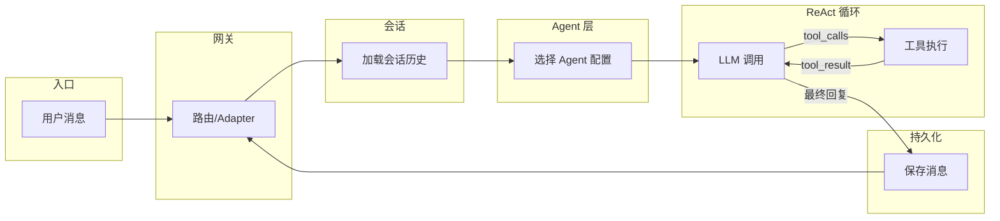

# 从 0 到 1 自建多 Agent 助手后端（Node 版）

> **说明**：本文档独立于 XimaLobster 主代码库，为通用自建思路与路线图；后端以 Node.js 为例，其他语言可类比实现。

---

## 一、目标与范围

- **目标**：自建一个「多入口、多 Agent、带工具与记忆」的 AI 助手后端（Node 版），支持对话、工具调用（ReAct）、会话持久化，并可扩展 IM 通道与多 Agent 协作。
- **范围**：以后端核心与必要 API 为主；前端/桌面仅说明对接方式（HTTP/SSE），不展开具体实现。

---

## 二、Node 后端可行性小结

用 Node.js 替代 Python 实现同类后端**可行**。核心链路在 Node 生态中均有对应：

| 能力           | Python 常见实现         | Node 对应                               |
| -------------- | ----------------------- | --------------------------------------- |
| 异步           | asyncio                 | Event Loop + async/await                |
| HTTP/SSE       | FastAPI                 | Fastify / Express / Hono                |
| LLM            | 自研 client / LangChain | Vercel AI SDK / LangChain.js / 各厂 SDK |
| ReAct/工具循环 | 自实现循环              | 同逻辑，无语言依赖                      |
| 会话/存储      | SQLite + 内存           | better-sqlite3 / pg                     |
| 向量检索       | 自研或 Chroma 等        | pgvector / Qdrant 等 HTTP 客户端        |
| Shell/子进程   | subprocess              | child_process + Promise                 |
| IM 通道        | Webhook/WS              | 同上，协议与语言无关                    |
| MCP            | stdio 子进程            | @modelcontextprotocol/sdk 或自实现      |
| 技能/进化      | 配置 + pip/动态加载     | 配置 + npm/动态 require，注意沙箱       |

需注意：若技能实现为 Python 脚本，可保留「子进程调 Python」的桥接；桌面端仍可用 Tauri，通过 HTTP 与 Node 后端通信。

---

## 三、技术选型（Node 栈）

| 层级       | 推荐选型                          | 备选                 |
| ---------- | --------------------------------- | -------------------- |
| 运行时     | Node 18+                          | —                    |
| Web 框架   | Fastify                           | Express、Hono        |
| LLM        | Vercel AI SDK 或 LangChain.js     | 各厂官方 SDK 封装    |
| 存储       | SQLite（better-sqlite3）          | PostgreSQL           |
| 向量       | pgvector / 外部向量服务 HTTP 接口 | 内存向量库（仅开发） |
| MCP 客户端 | @modelcontextprotocol/sdk         | 自实现 stdio 协议    |

---

## 四、从 0 到 1 的阶段划分

建议按依赖关系顺序推进，每阶段都可独立跑通再进入下一阶段。

### Phase 1 — 最小可对话

- 实现单轮对话 API：`POST /chat`，请求体含 `message`，调用一个 LLM（如 OpenAI/Anthropic），返回文本。
- 支持**流式响应**：SSE（Server-Sent Events）或 Transfer-Encoding: chunked，便于前端打字机效果。
- 无工具、无记忆、无会话，仅「用户消息 → LLM → 响应」。

**产出**：一个可调用的 HTTP 服务 + 流式回复。

---

### Phase 2 — 工具与 ReAct

- **工具描述**：为每个工具定义 schema（name, description, parameters 的 JSON Schema），在请求 LLM 时通过 system 或 messages 注入「可用工具列表」。
- **ReAct 循环**：
  1. 调用 LLM，若返回中有 `tool_calls`，则解析出 `tool_name` 与 `arguments`；
  2. 在本进程内执行对应工具（如 `get_time`、`read_file`），得到结果；
  3. 将 `tool_use` 与 `tool_result` 追加到 messages，再次调用 LLM；
  4. 重复直到无 `tool_calls` 或达到最大步数（如 20），最后一段 assistant 内容即为最终回复。
- 先实现 1～2 个简单工具（如获取当前时间、读本地文件），再扩展。

**产出**：带工具调用的对话链路，支持多轮 tool_use/tool_result。

---

### Phase 3 — 会话与上下文

- 引入 **session_id**：创建会话时分配 ID，后续请求携带该 ID。
- **持久化**：将每条 user/assistant（及 tool_use/tool_result）写入 DB（如 SQLite 的 conversations + messages 表）。
- 每次请求：根据 session_id 加载历史消息，拼接到本次 user message 之前，再发给 LLM，保证多轮上下文。

**产出**：多轮对话、历史可查、会话隔离。

---

### Phase 4 — 记忆（可选）

- **简单版**：在会话结束或关键节点，将摘要/关键事实写入 DB；检索时按关键词或时间查询，拼成一段「记忆」注入 system。
- **进阶**：引入向量存储（pgvector 或外部服务），对记忆做 embedding，按语义检索 Top-K 注入 system。设计可参考本仓库 [memory_architecture.md](memory_architecture.md)。

**产出**：跨会话的「记得用户偏好/历史」能力。

---

### Phase 5 — 多 Agent（可选）

- 维护多个 **Agent 配置**：名称、system prompt、可用工具集（或技能列表）。
- **路由**：根据用户意图或默认配置选择当前 Agent；可增加「委派」：当前 Agent 将子任务作为新消息发给另一 Agent，消息格式与单 Agent 一致，结果汇总后返回。
- 实现上可复用同一套「消息 → ReAct 循环 → 响应」逻辑，仅切换 system prompt 与工具集。

**产出**：多角色/多专家协作、委派与汇总。

---

### Phase 6 — 多入口与通道

- 保持 **/chat**（或内部 `handleMessage(sessionId, userMessage)`）为统一入口。
- 为每个 IM 平台写一个 **adapter**：接收 Webhook 或 WebSocket，将平台消息归一化为 `{ sessionId, userMessage }`，调用同一套处理逻辑，再将响应通过平台 API 回写。
- 先做 1 个通道（如 Telegram 或飞书）验证流程，再复制模式扩展其他平台。

**产出**：同一后端支持 HTTP API + 多种 IM。

---

### Phase 7 — 技能/插件与进化（可选）

- **技能**：用 JSON/YAML 描述「技能名、描述、工具列表或入口」，运行时按配置加载；或可插拔 Node 模块，通过统一接口注册工具。
- **进化**：失败分析（记录错误类型、上下文）、自动安装依赖（npm install）、或由 LLM 生成小脚本后在沙箱/子进程中执行（需严格限制权限与超时）。

**产出**：可扩展工具集与一定的自修复/自扩展能力。

---

## 五、核心数据流

整体从「用户发消息」到「响应回写」的流程可概括为：

- 多入口（HTTP、Telegram、飞书等）在 **Route** 归一化为同一「会话 + 用户消息」。
- **ReAct 循环**内：LLM 可能多次返回 tool_calls，每次执行工具后把结果塞回 messages 再调 LLM，直到无 tool_calls 或达步数上限。
- 最终回复写入 DB 并通过原通道回写用户。

---

## 六、安全与运维简要

- **工具执行**：工具名白名单、参数校验、超时与输出长度限制；危险操作（如执行任意 shell）需二次确认或仅内网开放。
- **密钥与配置**：API Key 等放环境变量或保密存储，不要写进代码或前端。
- **日志**：请求 ID、session_id、工具调用与错误码打日志，便于排查。
- **健康检查**：提供 `GET /health`，用于负载均衡与进程管理。
- **优雅关闭**：监听 SIGTERM/SIGINT，收尾进行中的请求后再退出。

---

## 七、参考与延伸

- 本仓库中的设计文档可作为「设计参考」（实现细节以当前 Python 代码为准，Node 版按思路自实现）：
  - [architecture.md](architecture.md) — 系统架构与数据流
  - [memory_architecture.md](memory_architecture.md) — 记忆存储与检索
  - [multi-agent-architecture.md](multi-agent-architecture.md) — 多 Agent 协作与路由
- 若你希望与现有 XimaLobster 行为对齐，可对照 [LEARNING_ROADMAP.md](LEARNING_ROADMAP.md) 中的阶段与源码，逐模块用 Node 重写或简化实现。
