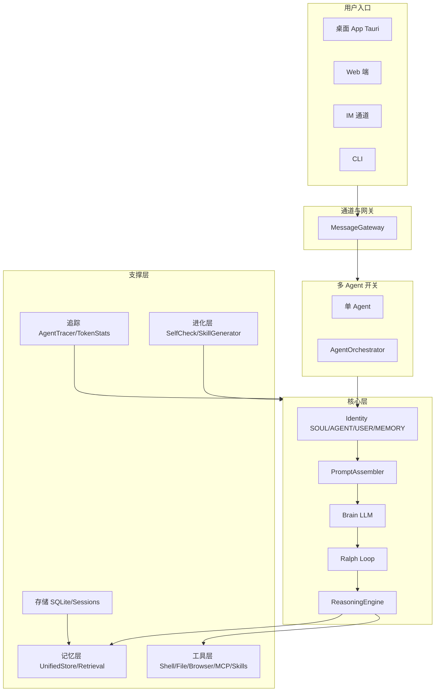

# XimaLobster 项目学习路线

本文档是**项目学习路线**的主入口，帮助你在较短时间内系统掌握 XimaLobster 的构成与实现细节。不替代现有架构/技能/记忆等专项文档，而是给出分阶段学习顺序、必读文档与必看源码，并串联一张总架构图与按主题的查阅索引。

---

## 一、项目概览与前置知识

### 1.1 项目是什么

XimaLobster 是一款**开源多 Agent AI 助手**——不只是聊天，而是一个能帮你做事的 AI 团队。核心能力包括：

- **多 Agent 协作**：专业分工、并行委派、自动接力、故障切换
- **ReAct 推理引擎**：想 → 做 → 看，三阶段显式推理，支持检查点回滚
- **89+ 工具**：Shell / 文件 / 浏览器 / 桌面自动化 / 搜索 / 定时任务 / MCP 等
- **6 大 IM 平台**：Telegram、飞书、企微、钉钉、QQ、OneBot
- **三层记忆系统**：工作记忆 + 核心记忆 + 动态检索，越用越懂你
- **自我进化**：自检修复、失败根因分析、技能自动生成

更完整的介绍见 [README_CN.md](../README_CN.md)，开发约定与模块概览见 [AGENTS.md](../AGENTS.md)。

### 1.2 技术栈一览

| 层级         | 技术                                                    |
| ------------ | ------------------------------------------------------- |
| **Backend**  | Python 3.11+，FastAPI，asyncio，aiosqlite               |
| **Frontend** | React 18，TypeScript，Vite 6（在 `apps/setup-center/`） |
| **Desktop**  | Tauri 2.x（Rust 壳）                                    |
| **LLM**      | Anthropic Claude、OpenAI 兼容 API（30+ 服务商）         |
| **IM 通道**  | Telegram、Feishu、DingTalk、WeCom、QQ、OneBot           |

### 1.3 建议前置知识

- **Python 异步**：`async/await`、asyncio 基本概念
- **FastAPI**：路由、依赖注入、请求/响应
- **React 基础**：组件、状态、Hooks（若要看前端）
- **Rust / Tauri**：若要看桌面壳与前后端桥接，需一点概念即可

### 1.4 Python 子项目与从 0 搭建

若你希望在 **Swell-Lobster** 仓库内从零搭建类似的 Python 后端（与 XimaLobster 多功能架构对齐），可参考：[Python 项目初始化与分批建设规划](PYTHON_PROJECT_INIT_AND_ROADMAP.md)。该文档包含初始化规划、目录与依赖、与 identity/docs 的衔接、以及后续分批阶段（Identity、核心执行链、工具与技能、通道与 API、记忆与进化）的路线图与学习顺序建议。

### 1.5 对标 OpenAkita 桌面端功能与菜单

若要在 Swell-Lobster 中实现与 OpenAkita 一致的桌面端效果（左侧菜单：聊天、消息通道、技能、MCP、计划任务、记忆管理、状态面板、Token 统计 + 配置及其二级菜单），可参考：[Swell-Lobster 对标 OpenAkita 功能与菜单开发规划](../docs/openakita-style-feature-plan.md)。该文档包含菜单结构、阶段 0～6 开发划分、任务表及实施顺序建议。

---

## 二、整体架构与请求主流程

### 2.1 架构分层图

从用户到响应，各层关系如下（基于 [architecture.md](architecture.md) 与 README 架构描述）：



### 2.2 一条消息的旅程

1. 用户通过桌面 App / Web / IM / CLI 发送消息
2. **Channel 网关**归一化消息（媒体预处理：语音→Whisper 转写，图片→Base64 等）
3. **会话管理**获取或创建上下文，可选 **Prompt 编译**（Stage 1）结构化请求
4. **Brain（Stage 2）** 与 **Ralph 循环**：LLM 推理 → 工具调用 → 结果回填 → 直至任务完成或放弃
5. 响应写入会话历史，经原通道返回用户

详细数据流见 [architecture.md](architecture.md) 的 Data Flow 一节。

### 2.3 学习顺序建议

按依赖关系，建议顺序为：

1. **Identity 与 Prompt** → 人设与系统提示从哪来
2. **Core（Agent / Brain / Ralph / ReasoningEngine）** → 单轮推理与「永不放弃」循环
3. **Tools & Skills** → 工具注册、暴露给 LLM、Skill 与系统工具关系
4. **Memory** → 三层记忆、存储、检索与注入时机
5. **Multi-Agent** → 路由、委派、故障切换
6. **Channels & API** → 消息如何从 IM/HTTP 进到 Agent、路由划分
7. **Desktop / Web 前端** → 壳与后端调用、主要页面
8. **Evolution / Scheduler / Tracing** → 自检、定时任务、可观测性

---

## 三、分阶段学习路线

每阶段格式：**目标** → **必读文档** → **必看源码** → **可选实践**。

---

### 阶段 1：身份与提示词（Identity & Prompt）

- **目标**：理解 Agent 的「人设」从哪里来、系统提示词如何组装。
- **必读**：[prompt_structure.md](prompt_structure.md)、[architecture.md](architecture.md) 的 Identity、Two-Stage Prompt 部分。
- **必看源码**：
  - [identity/](../identity/) 目录：SOUL、AGENT、USER、MEMORY，personas，runtime
  - [src/openakita/prompt/](../src/openakita/prompt/)：compiler、builder
  - [src/openakita/core/identity.py](../src/openakita/core/identity.py)
- **实践**：改一句 SOUL 或 AGENT 描述，跑一次对话看效果；理解 `identity/runtime/` 与 compiled 的用途。

---

### 阶段 2：核心执行链（Agent / Brain / Ralph / ReasoningEngine）

- **目标**：理解单轮推理与「永不放弃」循环。
- **必读**：[architecture.md](architecture.md)（Brain、Ralph、Model Switching 与 Tool-State Isolation）。
- **必看源码**：
  - [src/openakita/core/agent.py](../src/openakita/core/agent.py)（主 Agent 编排）
  - [src/openakita/core/brain.py](../src/openakita/core/brain.py)（LLM 调用、流式、工具）
  - [src/openakita/core/ralph.py](../src/openakita/core/ralph.py)（Ralph 循环）
  - [src/openakita/core/reasoning_engine.py](../src/openakita/core/reasoning_engine.py)（ReAct 引擎）
- **实践**：用 `openakita run "某任务"` 单步跟一条请求；在 Ralph 里打日志看失败重试。

---

### 阶段 3：工具与技能（Tools & Skills）

- **目标**：工具如何注册、如何暴露给 LLM、Skill 与系统工具的关系。
- **必读**：[tool-system-architecture.md](tool-system-architecture.md)、[skill-loading-architecture.md](skill-loading-architecture.md)、[skills.md](skills.md)。
- **必看源码**：
  - [src/openakita/tools/](../src/openakita/tools/)：handlers/、definitions/、catalog
  - [src/openakita/skills/](../src/openakita/skills/)：loader、registry、parser
  - [skills/system/](../skills/system/) 下 1～2 个 SKILL.md 示例
- **实践**：加一个简单系统工具（handler + definition + SKILL.md）；安装一个外部技能并触发。

---

### 阶段 4：记忆系统（Memory）

- **目标**：三层记忆、存储、检索与注入时机。
- **必读**：[memory_architecture.md](memory_architecture.md)。
- **必看源码**：
  - [src/openakita/memory/](../src/openakita/memory/)：unified_store、retrieval、consolidator、extractor
  - 存储表与 MEMORY.md / USER.md 的生成（文档中已有说明）
- **实践**：查一次记忆 API，看检索结果如何进入 Prompt。

---

### 阶段 5：多 Agent（Orchestrator / Factory / Profile）

- **目标**：多 Agent 开关、路由、委派、故障切换。
- **必读**：[multi-agent-architecture.md](multi-agent-architecture.md)、[agent-org-technical-design.md](agent-org-technical-design.md)。
- **必看源码**：
  - [src/openakita/agents/](../src/openakita/agents/)：orchestrator、factory、profile、presets、task_queue
  - [AGENTS.md](../AGENTS.md) 中 Multi-Agent 与 ProfileStore 说明
- **实践**：开启多 Agent，发一个会触发委派的任务，用 Dashboard 或日志跟一条委派链。

---

### 阶段 6：通道与 API（Channels & HTTP API）

- **目标**：消息如何从 IM/HTTP 进到 Agent、API 路由划分。
- **必读**：[architecture.md](architecture.md) Channel 部分、[im-channels.md](im-channels.md)、[im-channel-setup-tutorial.md](im-channel-setup-tutorial.md)。
- **必看源码**：
  - [src/openakita/channels/](../src/openakita/channels/)：gateway、adapters（选 1～2 个）
  - [src/openakita/api/server.py](../src/openakita/api/server.py)、[src/openakita/api/routes/](../src/openakita/api/routes/)（chat、sessions、agents、config 等）
- **实践**：用 curl 或 Postman 调一次 chat 流式接口；看一条 IM 消息从 adapter 到 gateway 的代码路径。

---

### 阶段 7：桌面与前端（Tauri + React）

- **目标**：桌面壳与 Web 端如何调后端、主要页面与状态。
- **必读**：[desktop-app-guide.md](desktop-app-guide.md)、README 多端访问部分。
- **必看源码**：
  - [apps/setup-center/src-tauri/](../apps/setup-center/src-tauri/)：main 入口、Tauri 命令与前后端桥
  - [apps/setup-center/src/](../apps/setup-center/src/)：App.tsx、views/（ChatView、AgentDashboardView、AgentManagerView、Config 等）
- **实践**：在桌面端改一个面板的标题或增加一个只读接口调用。

---

### 阶段 8：进化与运维（Evolution / Scheduler / Tracing）

- **目标**：自检、失败分析、技能生成、定时任务、可观测性。
- **必读**：[architecture.md](architecture.md) Evolution 部分、README 自我进化与安全部分。
- **必看源码**：
  - [src/openakita/evolution/](../src/openakita/evolution/)
  - [src/openakita/scheduler/](../src/openakita/scheduler/)
  - [src/openakita/tracing/](../src/openakita/tracing/)
- **实践**：看一次自检或失败分析日志；创建一个简单定时任务。

---

## 四、按主题的查阅索引

按「我想理解…」快速跳到推荐文档与源码：

| 主题                 | 推荐文档                                                                                                                   | 推荐源码                                                       |
| -------------------- | -------------------------------------------------------------------------------------------------------------------------- | -------------------------------------------------------------- |
| 系统提示词从哪来     | [prompt_structure.md](prompt_structure.md)、[architecture.md](architecture.md)                                             | `prompt/`、`core/identity.py`                                  |
| 单轮对话如何执行     | [architecture.md](architecture.md)                                                                                         | `core/agent.py`、`brain.py`、`ralph.py`、`reasoning_engine.py` |
| 工具如何被调用       | [tool-system-architecture.md](tool-system-architecture.md)、[skill-loading-architecture.md](skill-loading-architecture.md) | `tools/`、`skills/`                                            |
| 记忆如何存储与检索   | [memory_architecture.md](memory_architecture.md)                                                                           | `memory/`                                                      |
| 多 Agent 如何协作    | [multi-agent-architecture.md](multi-agent-architecture.md)                                                                 | `agents/`                                                      |
| IM 消息如何接入      | [im-channels.md](im-channels.md)、[im-channel-setup-tutorial.md](im-channel-setup-tutorial.md)                             | `channels/`                                                    |
| HTTP API 有哪些      | —                                                                                                                          | `api/server.py`、`api/routes/*.py`                             |
| 桌面端如何与后端通信 | [desktop-app-guide.md](desktop-app-guide.md)                                                                               | `apps/setup-center/src-tauri`、`src/App.tsx`                   |
| 身份与策略配置       | [prompt_structure.md](prompt_structure.md)、[configuration.md](configuration.md)                                           | `identity/`、`POLICIES.yaml`                                   |

---

## 五、已有文档清单（按模块）

便于按需深入，将 `docs/` 下与学习路线相关的文档按类别整理如下。

### 架构与设计

- [architecture.md](architecture.md) — 系统架构与核心组件
- [multi-agent-architecture.md](multi-agent-architecture.md) — 多 Agent 架构
- [agent-org-technical-design.md](agent-org-technical-design.md) — 组织编排技术设计
- [memory_architecture.md](memory_architecture.md) — 记忆系统架构
- [tool-system-architecture.md](tool-system-architecture.md) — 工具系统架构
- [skill-loading-architecture.md](skill-loading-architecture.md) — 技能加载架构
- [prompt_structure.md](prompt_structure.md) — 提示词结构

### 配置与部署

- [configuration.md](configuration.md) — 配置项说明
- [configuration-guide.md](configuration-guide.md) — 配置指南（含桌面端）
- [deploy.md](deploy.md) — 部署指南
- [getting-started.md](getting-started.md) — 快速开始

### 功能与教程

- [llm-provider-setup-tutorial.md](llm-provider-setup-tutorial.md) — LLM 服务商配置
- [im-channel-setup-tutorial.md](im-channel-setup-tutorial.md) — IM 通道配置
- [im-channels.md](im-channels.md) — IM 通道技术参考
- [skills.md](skills.md) — 技能系统
- [skill-usage-guide.md](skill-usage-guide.md) — 技能使用指南
- [mcp-integration.md](mcp-integration.md) — MCP 集成
- [desktop-app-guide.md](desktop-app-guide.md) — 桌面应用指南
- [persona-and-liveness.md](persona-and-liveness.md) — 人格与活人感引擎

### 开发与测试

- [testing.md](testing.md) — 测试说明
- [test-cases.md](test-cases.md) — 测试用例
- [tool-definition-spec.md](tool-definition-spec.md) — 工具定义规范

### 自建与扩展

- [BUILD_SIMILAR_AGENT_BACKEND.md](BUILD_SIMILAR_AGENT_BACKEND.md) — 从 0 到 1 自建类似多 Agent 助手后端（Node 版思路，独立于本项目）

---

## 六、开发与调试小贴士

### 常用命令

```bash
openakita                        # 交互式聊天
openakita run "任务描述"          # 执行单个任务
openakita serve                  # 服务模式（供桌面/Web/IM 接入）
openakita serve --dev            # 开发模式，热加载
openakita daemon start           # 后台守护进程
openakita status                 # 查看运行状态
```

桌面端开发：

```bash
cd apps/setup-center && npm install
npm run tauri dev
```

### 测试

- 全量测试：`pytest`（asyncio_mode=auto）
- 单元测试：`pytest tests/unit/`
- 按关键字：`pytest -k "test_brain"`
- 覆盖率：`pytest --cov=src/openakita`

测试路径在 `tests/`，由 `pyproject.toml` 配置。

### 日志与调试

- 关键模块使用标准 `logging`，可通过环境变量或配置调整日志级别
- 单步跟请求时，可在 `core/ralph.py`、`core/agent.py`、`api/routes/chat.py` 等处加日志观察消息与工具调用

### 已知注意点（来自 AGENTS.md）

- **identity/AGENT.md** 是 OpenAkita 自身行为规范，与业界常用的 **AGENTS.md**（项目说明）不是同一文件，不要混淆
- **multi_agent_enabled** 是运行时开关，存在 `data/runtime_state.json`，非静态配置
- 技能加载顺序：`__builtin__` → workspace → `.cursor/skills` → `.claude/skills` → `skills/` → 全局 home 目录
- 身份文件变更后，`prompt/compiler.py` 需重新跑；`builder.py` 会通过 `check_compiled_outdated()` 检测过期

---

_文档维护：若模块或文档路径有变更，请同步更新本学习路线中的链接与章节。_
