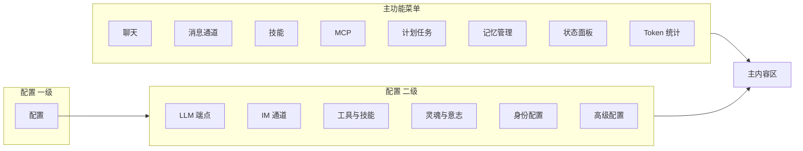

# Swell-Lobster 对标 OpenAkita 功能与菜单开发规划

## 一、目标与范围

- **目标**：在 swell-lobster 中实现与 OpenAkita 一致的桌面端效果——左侧固定菜单 + 右侧主内容区，菜单包含主功能与「配置」折叠区及其二级项。
- **参考**：功能与交互完全参考 [OpenAkita](F:\FrontEnd\OtherCode\openakita)（`apps/setup-center` 前端 + `src/openakita/api` 后端）。
- **当前基础**：
  - 前端：[apps/web-ui](f:\FrontEnd\Code\swell-lobster\apps\web-ui) 仅简单顶栏 + Home/NotFound，无侧边栏。
  - 后端：Python CLI 占位（[src/swell_lobster/main.py](f:\FrontEnd\Code\swell-lobster\src\swell_lobster\main.py)），无 HTTP API。

---

## 二、菜单结构（与 OpenAkita 对齐）

| 类型     | 菜单项     | 对应 OpenAkita View/Step          | 后端 API 参考                                           |
| -------- | ---------- | --------------------------------- | ------------------------------------------------------- |
| 主菜单   | 聊天       | ChatView                          | `/api/chat`、sessions                                   |
| 主菜单   | 消息通道   | IMView                            | `/api/im/channels`、IM 配置                             |
| 主菜单   | 技能       | SkillManager                      | `/api/skills`、`/api/config/skills`                     |
| 主菜单   | MCP        | MCPView                           | `/api/mcp/*`                                            |
| 主菜单   | 计划任务   | SchedulerView                     | `/api/scheduler/*`                                      |
| 主菜单   | 记忆管理   | MemoryView                        | `/api/memories/*`                                       |
| 主菜单   | 状态面板   | status/dashboard                  | `/api/health`、端点/IM 状态                             |
| 主菜单   | Token 统计 | TokenStatsView                    | `/api/stats/tokens/*`                                   |
| 配置二级 | LLM 端点   | wizard step llm / AgentSystemView | `/api/config/endpoints`、reload、providers、list-models |
| 配置二级 | IM 通道    | wizard step im / IMConfigView     | `/api/config/env`、IM 开关与 Bot                        |
| 配置二级 | 工具与技能 | wizard step tools                 | `/api/config/skills`、skills 列表                       |
| 配置二级 | 灵魂与意志 | wizard step agent                 | Agent 配置（SOUL/AGENT 等）                             |
| 配置二级 | 身份配置   | IdentityView                      | `/api/identity/*`                                       |
| 配置二级 | 高级配置   | wizard step advanced              | `/api/config/env`、disabled-views、诊断等               |

---

## 三、开发阶段划分

### 阶段 0：前端骨架与路由（不依赖后端）

- **0.1** 布局：在 [apps/web-ui](f:\FrontEnd\Code\swell-lobster\apps\web-ui) 增加**左侧固定侧边栏 + 右侧主内容区**（参考 OpenAkita [Sidebar.tsx](F:\FrontEnd\OtherCode\openakita\apps\setup-center\src\components\Sidebar.tsx) 与 [App.tsx](F:\FrontEnd\OtherCode\openakita\apps\setup-center\src\App.tsx) 的布局）。
- **0.2** 路由：定义所有菜单项对应路由（如 `/chat`、`/im`、`/skills`、`/mcp`、`/scheduler`、`/memory`、`/status`、`/token-stats`；配置折叠下 `/config/llm`、`/config/im`、`/config/tools`、`/config/soul`、`/config/identity`、`/config/advanced`）。
- **0.3** 侧栏组件：实现侧栏 UI（Logo、主菜单 8 项、配置折叠 + 6 个二级项、底部版本/链接占位），与当前 view 高亮、折叠状态同步。
- **0.4** 占位页：为上述每个路由创建占位页面（标题 + 简短说明），确保「按菜单逐项开发」时每步都有对应页面可挂载。

**交付**：侧栏 + 路由 + 14 个占位页，无后端即可完成导航与布局验收。

---

### 阶段 1：配置 - LLM 端点

- **1.1 后端**：在 Python 中提供 FastAPI 服务（或先独立 `api/` 模块），实现：
  - `GET/POST /api/config/endpoints`（读写 `data/llm_endpoints.json`，格式参考 OpenAkita [config routes](F:\FrontEnd\OtherCode\openakita\src\openakita\api\routes\config.py)）；
  - `GET /api/config/providers`（可选：服务商列表）；
  - `POST /api/config/list-models`（可选：按 base_url + api_key 拉模型列表）；
  - `POST /api/config/reload`、`POST /api/config/restart`（占位亦可）。
- **1.2 前端**：LLM 端点配置页（`/config/llm`）——列表展示、添加/编辑/删除端点、主备优先级、提示词编译模型与 STT 端点区块（可先静态或从 1.1 API 读写在库）。
- **1.3**：保存/应用并重启流程（按钮 + 调用 reload 或 restart）。

**交付**：LLM 端点页与后端 API 可用，行为对齐 OpenAkita 的「LLM 端点」配置。

---

### 阶段 2：配置 - IM 通道、工具与技能、灵魂与意志、身份配置、高级配置

按**一个菜单一个子阶段**推进，每子阶段包含后端 API（若有）+ 前端页面。

- **2.1 IM 通道**：后端 `GET /api/im/channels`、读写 IM 开关与 Bot 配置（如写 `.env` 或专用 config）；前端 IM 配置页（通道列表、启用/禁用、Bot 配置入口）。
- **2.2 工具与技能**：后端 `GET/POST /api/config/skills`（读写 `data/skills.json`）；前端工具与技能页（技能列表、启用/禁用、与主菜单「技能」可共享数据源）。
- **2.3 灵魂与意志**：后端可复用 identity 的读接口；前端灵魂与意志页（SOUL/AGENT/行为相关配置入口或文案说明）。
- **2.4 身份配置**：后端 `GET/POST /api/identity/`（列表、读、写、校验身份文件）；前端身份配置页（IdentityView 式：SOUL、AGENT、USER、MEMORY、personas、policies 等）。
- **2.5 高级配置**：后端 `GET/POST /api/config/disabled-views`、环境变量/诊断占位；前端高级配置页（隐藏模块开关、日志/清理等）。

**交付**：配置下 6 个二级菜单均有对应页面与必要 API，与 OpenAkita 配置区行为一致。

---

### 阶段 3：主功能 - 聊天

- **3.1 后端**：`POST /api/chat`（SSE 流式，可先非流式占位）、会话列表/创建（如 `GET/POST /api/sessions`）。
- **3.2 前端**：聊天页（对话列表、当前对话消息列表、输入框、发送、可选模型选择），与后端 chat 接口对接。
- **3.3**：流式输出、思考过程/工具调用等事件（与 OpenAkita ChatView 对齐，可分步实现）。

**交付**：主菜单「聊天」可完成一轮对话并展示回复。

---

### 阶段 4：主功能 - 消息通道、技能、MCP、计划任务、记忆管理

每个主菜单一项，建议顺序：**消息通道 → 技能 → MCP → 计划任务 → 记忆管理**（按依赖从轻到重）。

- **4.1 消息通道**：后端已有 `/api/im/channels`；前端消息通道页（通道列表、在线状态、会话数、入口到 IM 配置）。
- **4.2 技能**：后端 `GET /api/skills`、安装/卸载/刷新（参考 OpenAkita [skills routes](F:\FrontEnd\OtherCode\openakita\src\openakita\api\routes\skills.py)）；前端技能管理页（列表、启用/禁用、安装、卸载、编辑 SKILL.md）。
- **4.3 MCP**：后端 `GET/POST /api/mcp/`（服务器列表、连接/断开、工具列表）；前端 MCP 页（服务器配置、状态、可用工具列表）。
- **4.4 计划任务**：后端 `GET/POST /api/scheduler/`（CRUD、触发）；前端计划任务页（任务列表、新建/编辑/删除、立即执行）。
- **4.5 记忆管理**：后端 `GET/POST /api/memories/`（列表、增删改、LLM 审查）；前端记忆管理页（记忆列表、筛选、编辑、审查）。

**交付**：上述 5 个主菜单均有可用的列表与核心操作。

---

### 阶段 5：主功能 - 状态面板、Token 统计

- **5.1 状态面板**：后端 `GET /api/health`、端点健康、IM 状态（若已有）；前端状态页（服务状态、端点健康、IM 在线状态、可选自启/日志入口）。
- **5.2 Token 统计**：后端 `GET /api/stats/tokens/`（summary、timeline、sessions、total）；前端 Token 统计页（汇总、时间线图、按会话/端点等，参考 OpenAkita TokenStatsView）。

**交付**：状态面板与 Token 统计页数据来自后端并展示完整。

---

### 阶段 6：联调与体验收尾

- 前后端联调（含错误态、加载态、无数据态）。
- 侧栏「配置」折叠与二级项与路由一致；多 Agent 相关入口可按需后续加。
- 可选：Topbar（工作区、运行状态、连接/断开、刷新）与 OpenAkita 对齐。

---

## 四、任务拆分表（按菜单 + 前后端）

| 序号 | 任务                                                             | 类型      | 依赖     |
| ---- | ---------------------------------------------------------------- | --------- | -------- |
| 0.1  | 前端：侧栏 + 主内容区布局                                        | 前端      | -        |
| 0.2  | 前端：全量路由定义                                               | 前端      | 0.1      |
| 0.3  | 前端：Sidebar 组件（主菜单 8 + 配置 6）                          | 前端      | 0.2      |
| 0.4  | 前端：14 个占位页                                                | 前端      | 0.2      |
| 1.1  | 后端：FastAPI + config/endpoints、reload、providers、list-models | 后端      | -        |
| 1.2  | 前端：LLM 端点配置页                                             | 前端      | 0.x, 1.1 |
| 1.3  | 前端：保存并重启/应用流程                                        | 前端      | 1.2      |
| 2.1  | 后端 + 前端：IM 通道配置                                         | 后端+前端 | 0.x      |
| 2.2  | 后端 + 前端：工具与技能配置                                      | 后端+前端 | 0.x      |
| 2.3  | 后端 + 前端：灵魂与意志页                                        | 后端+前端 | 0.x      |
| 2.4  | 后端 + 前端：身份配置                                            | 后端+前端 | 0.x      |
| 2.5  | 后端 + 前端：高级配置                                            | 后端+前端 | 0.x      |
| 3.1  | 后端：chat、sessions API                                         | 后端      | -        |
| 3.2  | 前端：聊天页                                                     | 前端      | 0.x, 3.1 |
| 3.3  | 流式/思考/工具事件（可选增强）                                   | 前端+后端 | 3.2      |
| 4.1  | 消息通道页                                                       | 前端+后端 | 0.x, 2.1 |
| 4.2  | 技能管理页 + skills API                                          | 前端+后端 | 0.x      |
| 4.3  | MCP 页 + mcp API                                                 | 前端+后端 | 0.x      |
| 4.4  | 计划任务页 + scheduler API                                       | 前端+后端 | 0.x      |
| 4.5  | 记忆管理页 + memories API                                        | 前端+后端 | 0.x      |
| 5.1  | 状态面板页 + health                                              | 前端+后端 | 0.x      |
| 5.2  | Token 统计页 + stats/tokens                                      | 前端+后端 | 0.x      |
| 6    | 联调、错误态、Topbar 等收尾                                      | 全栈      | 1–5      |

---

## 五、规划文档落地点

- **主规划文档**：保存至 [docs/openakita-style-feature-plan.md](f:\FrontEnd\Code\swell-lobster\docs\openakita-style-feature-plan.md)（或 [learning-docs/](f:\FrontEnd\Code\swell-lobster\learning-docs) 下同名文件），内容即本规划正文（目标、菜单结构、阶段 0～6、任务表）。
- **与现有文档衔接**：在 [learning-docs/LEARNING_ROADMAP.md](f:\FrontEnd\Code\swell-lobster\learning-docs\LEARNING_ROADMAP.md) 中增加一节「对标 OpenAkita 桌面端功能与菜单」，链接到上述规划文档；若与 [python项目初始化与分批规划77d61b38.plan.md](f:\FrontEnd\Code\swell-lobster\learning-docs\python_项目初始化与分批规划_77d61b38.plan.md) 中的「通道与 API」「工具与技能」等阶段有重叠，可在规划中注明「后端 API 与 Python 分批规划第 5 阶段对齐」。

---

## 六、实施顺序建议（简要）

1. 先做**阶段 0**，验收布局与路由。
2. 再做**阶段 1**（LLM 端点），确立前后端协作模式与配置读写流程。
3. 按**阶段 2** 顺序完成配置区其余 5 项。
4. 按**阶段 3 → 4 → 5** 完成主功能 8 项。
5. 最后**阶段 6** 联调与收尾。

每个菜单对应「一个或一组任务」，可按上表逐项勾选推进，并优先保证「配置」下 6 项与「聊天」先跑通，再扩展其余主功能。
