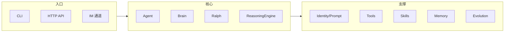

# Swell-Lobster Python 项目初始化与分批建设规划

## 一、目标与参考

- **目标**：在当前 monorepo（已有 `apps/web-ui`、`identity/`、`docs/`）中初始化一个 Python 子项目，参考 [ximalobster](/Users/xmly/XMLY/code-ai/ximalobster) 的多功能设计，从 0 分阶段做到可运行、可扩展。
- **参考项目**：ximalobster 采用 `src/openakita/` 布局，包含 core（Agent/Brain/Ralph/ReasoningEngine）、tools、skills、channels、evolution、prompt、memory、api 等，根目录有 `pyproject.toml`、`skills/`、`mcps/`、`identity/`，与现有 swell-lobster 的 identity/docs 结构可对齐。

## 二、多功能设计概览（从 0 理解）

ximalobster 的「多功能」在代码与目录上的体现可概括为：



- **多入口**：CLI（Typer）、HTTP API（FastAPI）、多 IM 通道（Telegram/飞书等），统一经 Channel 网关到 Agent。
- **核心链**：Identity（SOUL/AGENT/USER/MEMORY）→ Prompt 组装 → Brain（LLM）→ Ralph 循环 → ReasoningEngine（ReAct）→ 工具调用。
- **工具与技能**：内置工具（Shell/File/Web/MCP 等）在 `tools/` 注册；外部能力以「技能」形式挂在 `skills/`（SKILL.md + 可选脚本），由 loader/registry 加载。
- **进化**：evolution 模块（Analyzer/Installer/SkillGenerator）在失败或缺失能力时自动尝试安装或生成技能。

初始化阶段只需先搭好「可运行的骨架」和清晰分层，后续再按阶段补齐各块。

## 三、在 Monorepo 中的放置方式

两种常见做法：

| 方案                    | 位置                                                                                               | 优点                                                | 缺点                                   |
| ----------------------- | -------------------------------------------------------------------------------------------------- | --------------------------------------------------- | -------------------------------------- |
| **A：根目录 Python 包** | 根目录 `pyproject.toml` + `src/swell_lobster/`                                                     | 与 ximalobster 一致，identity/docs 自然在根目录共享 | 根目录同时存在 Node 与 Python 两套配置 |
| **B：apps 下 backend**  | `apps/backend/pyproject.toml` + `apps/backend/src/swell_lobster/` 或 `apps/backend/swell_lobster/` | 与 `apps/web-ui` 对称，前端/后端清晰                | identity 需通过路径或复制引用          |

**推荐方案 A**：与参考项目一致，且你已有根目录 `identity/`、`docs/`，便于后续像 ximalobster 一样从根目录读取 identity、挂载 skills。若希望 Python 仅作「后端服务」且与 web-ui 强绑定，再考虑方案 B。

## 四、初始化阶段详细规划（当前重点）

### 4.1 目录与文件结构（最小可用）

在方案 A 下，首次初始化建议只建必要节点，避免一次性复制过多模块：

```
swell-lobster/
├── pyproject.toml          # 新建：Python 项目声明与依赖
├── src/
│   └── swell_lobster/      # 新建：主包
│       ├── __init__.py     # 版本信息
│       ├── config.py       # 配置（pydantic-settings）
│       ├── main.py         # CLI 入口（Typer）
│       └── core/           # 核心占位
│           ├── __init__.py
│           └── (空或占位)
├── identity/               # 已有，复用
├── docs/                   # 已有
└── learning-docs/          # 已有，此处放规划与学习文档
```

后续再在 `src/swell_lobster/` 下按需增加 `tools/`、`prompt/`、`channels/`、`skills/`、`evolution/` 等，与 ximalobster 对齐。

### 4.2 pyproject.toml 内容要点

- **项目元数据**：`name="swell-lobster"`（或 `swell_lobster`），`version="0.1.0"`，`requires-python=">=3.11"`。
- **构建**：`build-system` 使用 `hatchling`，`packages` 指定 `src/swell_lobster`（或用 `[tool.hatch.build.targets.wheel] packages = ["src/swell_lobster"]`）。
- **依赖**：先只加「初始化阶段」必需项，例如：
  - `typer`、`rich`（CLI）
  - `pydantic`、`pydantic-settings`（配置）
  - `python-dotenv`（环境变量）
- **可选依赖**：可预留 `[project.optional-dependencies]` 的 `dev`（pytest、ruff、mypy）、后续的 `api`（fastapi、uvicorn）、`llm`（anthropic、openai）等，初始化阶段可不全部安装。
- **入口点**：`[project.scripts]` 中设一个 CLI，例如 `swell-lobster = "swell_lobster.main:app"`。

不复制 ximalobster 的完整依赖与 force-include，等「完善阶段」再按需加 LLM、FastAPI、tools 等。

### 4.3 与现有资源的衔接

- **identity**：在 `config.py` 中通过 `Path(__file__).resolve().parent.parent.parent / "identity"` 或通过配置项 `identity_dir` 指向仓库根目录的 `identity/`，为后续 Identity 模块读取 SOUL/AGENT/USER/MEMORY 做准备。
- **docs**：在 `learning-docs/` 中新增「Python 项目初始化与分批建设规划」文档（即本规划），并在 `LEARNING_ROADMAP.md` 中增加指向该文档的链接，便于从 0 跟进。

### 4.4 初始化阶段交付清单

1. **仓库根目录**：`pyproject.toml`（含 name、version、build、最小依赖、scripts 入口）。
2. **源码**：`src/swell_lobster/__init__.py`（`__version__`）、`config.py`（如 `Settings(BaseSettings)` 且含 `identity_dir`）、`main.py`（Typer app，如 `swell-lobster hello` 或 `run` 占位命令）。
3. **文档**：在 `learning-docs/` 下新增 `PYTHON_PROJECT_INIT_AND_ROADMAP.md`，内容包含：

- 本规划全文（目标、参考、多功能设计概览、放置方式、初始化详细规划、分批阶段划分、学习顺序建议）。

1. **可选**：`.gitignore` 中增加 `venv/`、`__pycache__/`、`.env` 等；`README.md` 或 `docs/` 中简短说明「如何运行 Python 部分」（如 `pip install -e .`、`swell-lobster hello`）。

## 五、分批阶段划分（初始化之后）

| 阶段  | 名称                    | 主要动作                                                                                                           |
| ----- | ----------------------- | ------------------------------------------------------------------------------------------------------------------ |
| **1** | **初始化**              | 如上：pyproject、src 骨架、config、CLI 占位、规划文档。                                                            |
| **2** | **完善配置与 Identity** | 从 `identity/` 读取 SOUL/AGENT 等；Prompt 组装占位；可选的 prompt 编译（Stage 1）设计。                            |
| **3** | **核心执行链**          | 引入 Brain（单 LLM 调用）、Ralph 循环占位、ReasoningEngine（ReAct）最小实现；单轮「用户消息 → Brain → 响应」跑通。 |
| **4** | **工具与技能**          | 注册 1～2 个内置工具（如 echo、read_file）；技能目录与 loader/registry 设计；与 Agent 的 tool 暴露。               |
| **5** | **通道与 API**          | FastAPI 服务、健康检查与简单 chat 接口；可选 1 个 IM 通道适配（如 Telegram）或仅 HTTP。                            |
| **6** | **记忆与进化**          | 记忆层占位（如 SQLite）；进化模块占位（失败分析、技能安装/生成预留接口）。                                         |

每阶段都在 `PYTHON_PROJECT_INIT_AND_ROADMAP.md` 中保留「阶段目标、必读/必看、验收标准」，便于从 0 按顺序学习与实现。

## 六、文档输出与学习顺序

- **主文档**：`learning-docs/PYTHON_PROJECT_INIT_AND_ROADMAP.md`
  - 内容：目标、参考、多功能设计概览（含 mermaid）、方案 A/B 对比、初始化详细规划（目录、pyproject、衔接、交付清单）、分批阶段表、学习顺序建议。
- **学习顺序建议**（与 ximalobster 的 LEARNING_ROADMAP 对齐）：Identity → Core（Agent/Brain/Ralph/Reasoning）→ Tools & Skills → Memory → Channels & API → Evolution。
- **在现有路线中的位置**：在 `learning-docs/LEARNING_ROADMAP.md` 中增加一节「Python 子项目与从 0 搭建」，链接到 `PYTHON_PROJECT_INIT_AND_ROADMAP.md`。

## 七、实施顺序建议（仅初始化）

1. 在仓库根目录创建 `pyproject.toml` 和 `src/swell_lobster/` 及上述最小文件集。
2. 实现 `config.py` 中 `identity_dir` 指向根目录 `identity/`。
3. 实现 `main.py` 中 Typer 入口及一条占位命令（如 `swell-lobster hello`）。
4. 编写并保存 `learning-docs/PYTHON_PROJECT_INIT_AND_ROADMAP.md`（含本规划全文）。
5. 更新 `learning-docs/LEARNING_ROADMAP.md`，加入对 Python 子项目规划文档的引用。
6. 验证：`pip install -e .` 与 `swell-lobster hello`（或等价命令）可运行。

以上为「当前重点：初始化如何规划」的完整方案；执行时可按上述实施顺序逐步落地，后续阶段在文档中按表展开即可。
